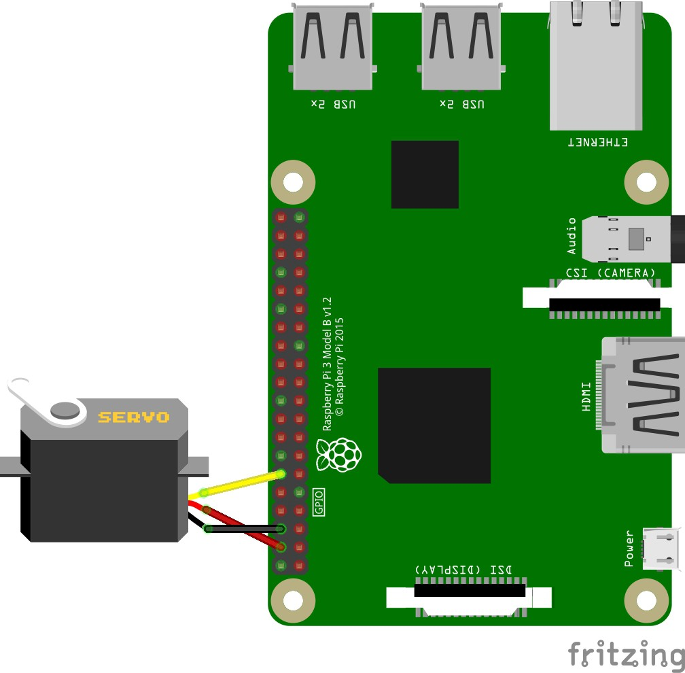

# Criando um ROS Package em python para o Turtlebot3. 

## Objetivo

Queremos ao final desse tutorial ter uma forma de controlar o ângulo da câmera do nosso robô TurtleBot3 através do ROS. Como faremos isso? Simples! Vamos criar o nosso própio ROS package.


## Preparações

Se estiver utilizando o robô TurtleBot3 da matéria de robótica, pule para parte Criando o ROS Package. 

Caso contrário, execute os passos abaixo.

Abra um terminal (Crtl+Alt+T) e execute os comando abaixo:

Instalando alguns pacotes e bibliotecas para ter acesso aos pinos (GPIO) da Raspberry do robô.
 
```bash
  sudo apt update
  sudo apt install python-dev python-pip python-setuptools
  pip install RPi.GPIO
```      

Criando um novo Workspace, caso tenha instalado o ROS e ainda não tenha criado nenhum ainda.
```
  mkdir ~/catkin_ws/src
  cd ~/catkin_ws/src
  catkin_init_workspace
```

## Criando o ROS Packgage

Agora vamos criar o ROS packgage, o nome será "servo_camera" e terá 3 dependências, são elas:

    rospy = para conectar o Python ao ROS
    std_msgs = Wrappers(invólucro) padrão para os tipos primitivos de mensagem ROS (String, Int, Char, Byte...) 
    python-rpi.gpio = para acessar os pinos(GPIO)

No terminal execute os comandos:

```
    cd ~/catkin_ws/src
    catkin_create_pkg servo_camera rospy std_msgs -s python-rpi.gpio
```
Pronto! Package criado com sucesso, no terminal vamos observar:

```
    insper@robo:~/catkin_ws/src$ catkin_create_pkg servo_camera rospy std_msgs -s python-rpi.gpio
    Created file servo_camera/CMakeLists.txt
    Created file servo_camera/package.xml
    Created folder servo_camera/src
    Successfully created files in /home/engecorp/catkin_ws/src/servo_camera. Please adjust the values in package.xml.
```
## Escrevendo o ROS node

A câmera do nosso robo está conecta em um servo motor, logo, temos que escrever um Script Python que recebe comandos publicados em ROS e converte em um sinal PWM que determina a posição do servo motor.

No terminal, crie dentro da pasta /src um novo arquivo Python executável:

```
    cd servo_camera/src/
    touch driver_node
    chmod a+x driver_node
```

Abra o script Python com o editor da sua preferência:

```bash
    nano driver_node
```

Cole o código abaixo:

```python
#!/usr/bin/env python

# Importa as bibliotecas do ROS e do Python
import rospy
from std_msgs.msg import String, UInt8

import RPi.GPIO as GPIO
import time as time

# Seta o modo do  GPIO
GPIO.setmode(GPIO.BCM)
GPIO.setwarnings(False)

# Seta o GPIO do servo motor
pinMotorAForwards = 18

# Seta a frequencia
Frequency = 50
# Seta o DutyCycle
DutyCycle = 8
DutyCycle2 =5
# Para o servo motor
Stop = 0

# Seta o pino do servo motor como saida
GPIO.setup(pinMotorAForwards, GPIO.OUT)

# Ajusta a frequencia do PWM
pwmMotor = GPIO.PWM(pinMotorAForwards, Frequency)

# Inicializa o PWM (servo parado)
pwmMotor.start(Stop)

# Funcao stop servo motor
def StopMotor():
    pwmMotor.ChangeDutyCycle(Stop)

# Funcao sobe camera
def SobeCamera():
    pwmMotor.ChangeDutyCycle(DutyCycle)

# Funcao desce camera
def DesceCamera():
    pwmMotor.ChangeDutyCycle(DutyCycle2)

# Funcao posicao
def PosCamera(command):
    pwmMotor.ChangeDutyCycle(command)

# Funcao Callback (le o comando recebido)
def CommandCallback(commandMessage):
    command = commandMessage.data
    if command == 'sobe':
        print('sobe Camera')
        SobeCamera()
        time.sleep(0.5)
        StopMotor()
        time.sleep(0.5)

    elif command == 'desce':
        print('Desce Camera')
        DesceCamera()
        time.sleep(0.5)
        StopMotor()
        time.sleep(0.5)

    elif command == 'stop':
        print('Parando')
        StopMotor()
    else:
        print('Posicao', command)
        PosCamera(command)
        time.sleep(0.5)
        StopMotor()
        time.sleep(0.5)

# Incia o node 
rospy.init_node('driver')

rospy.Subscriber('servo_camera/position', UInt8, CommandCallback)
rospy.Subscriber('servo_camera/command', String, CommandCallback)

rospy.spin()
print('Shutting down: stopping motors')
StopMotor()
```

Salve e feche o arquivo.

## Compilando o Workspace com o nosso package:

Para finalizar a criação do nosso package, vamos compilar o Workspace no /catkin_ws, vale resaltar que deve ser compilado na raiz do Workspace. No terminal execute:

```
    cd ~/catkin_ws
    catkin_make
```

Se a compilação chegou em 100%, tudo ocorreu corretamente. O terminal irá indicar algo parecido: 

```bash
insper@robo:~/catkin_ws $ catkin_make
Base path: /home/pi/catkin_ws
Source space: /home/pi/catkin_ws/src
Build space: /home/pi/catkin_ws/build
Devel space: /home/pi/catkin_ws/devel
Install space: /home/pi/catkin_ws/install
####
#### Running command: "make cmake_check_build_system" in "/home/pi/catkin_ws/build"
####
####
#### Running command: "make -j4 -l4" in "/home/pi/catkin_ws/build"
####
[  0%] Built target sensor_msgs_generate_messages_py
[  0%] Built target std_msgs_generate_messages_py
[  0%] Built target _turtlebot3_msgs_generate_messages_check_deps_Sound
[  0%] Built target _turtlebot3_msgs_generate_messages_check_deps_VersionInfo
[  0%] Built target _turtlebot3_msgs_generate_messages_check_deps_PanoramaImg
[  0%] Built target _turtlebot3_msgs_generate_messages_check_deps_SetFollowState
[  0%] Built target _turtlebot3_msgs_generate_messages_check_deps_SensorState
[  0%] Built target std_msgs_generate_messages_nodejs
[  0%] Built target sensor_msgs_generate_messages_nodejs
[  0%] Built target _turtlebot3_msgs_generate_messages_check_deps_TakePanorama
[  0%] Built target std_msgs_generate_messages_lisp
[  0%] Built target sensor_msgs_generate_messages_lisp
[  0%] Built target std_msgs_generate_messages_eus
[  0%] Built target sensor_msgs_generate_messages_eus
[  0%] Built target sensor_msgs_generate_messages_cpp
[  0%] Built target std_msgs_generate_messages_cpp
[  0%] Built target rosgraph_msgs_generate_messages_lisp
[  0%] Built target roscpp_generate_messages_nodejs
[  0%] Built target roscpp_generate_messages_lisp
[  0%] Built target roscpp_generate_messages_eus
[  0%] Built target roscpp_generate_messages_cpp
[  0%] Built target roscpp_generate_messages_py
[  0%] Built target rosgraph_msgs_generate_messages_nodejs
[  0%] Built target rosgraph_msgs_generate_messages_py
[  0%] Built target rosgraph_msgs_generate_messages_cpp
[  0%] Built target rosgraph_msgs_generate_messages_eus
[  2%] Built target raspicam_node_gencfg
[  6%] Built target raspicamcontrol
[ 10%] Built target raspicli
[ 10%] Built target diagnostic_msgs_generate_messages_lisp
[ 10%] Built target geometry_msgs_generate_messages_eus
[ 10%] Built target geometry_msgs_generate_messages_cpp
[ 10%] Built target geometry_msgs_generate_messages_lisp
[ 10%] Built target geometry_msgs_generate_messages_nodejs
[ 10%] Built target geometry_msgs_generate_messages_py
[ 10%] Built target diagnostic_msgs_generate_messages_nodejs
[ 10%] Built target diagnostic_msgs_generate_messages_cpp
[ 10%] Built target diagnostic_msgs_generate_messages_py
[ 10%] Built target diagnostic_msgs_generate_messages_eus
[ 28%] Built target turtlebot3_msgs_generate_messages_py
[ 41%] Built target turtlebot3_msgs_generate_messages_nodejs
[ 54%] Built target turtlebot3_msgs_generate_messages_lisp
[ 69%] Built target turtlebot3_msgs_generate_messages_eus
[ 82%] Built target turtlebot3_msgs_generate_messages_cpp
[ 86%] Built target hlds_laser_segment_publisher
[ 91%] Built target hlds_laser_publisher
[ 91%] Built target turtlebot3_msgs_generate_messages
[ 95%] Built target raspicam_node
[100%] Built target turtlebot3_diagnostics
```

Parabéns! Criamos nosso ROS packgage em Python que controla o ângulo da câmera do nosso robô TurtleBot3. 

## Executando

Para utilizar temos que rodar o node criado, no terminal do robo:

```
    rosrun servo_camera driver_node
```

Do PC remoto (PC que se conecta ao robô), podemos visualizar os 2 tópicos, execute no terminal:

```
    Roscore
```

Abra um novo terminal, não cancele a operação do primeiro terminal, rode:

```
    rostopic list
```

Dentre os topicos listados, temos os 2 topicos que criamos:

```
    /servo_camera/command
    /servo_camera/position
```

Para publicar um comando rode:

```
    rostopic pub -1 servo_camera/command std_msgs/String "sobe"
    rostopic pub -1 servo_camera/command std_msgs/String "desce"
```
    
ou 

```    
    rostopic pub -1 servo_camera/position std_msgs/UInt8 6
```
*** Observacao *** Existe uma limitação física na montagem da camera que restringe a variação do ângulo da câmera entre os valores 4 e 11.

## Ligação do Servo Motor na Raspberry Py 

A ligação do servo motor é bem simples e pode ser vista na imagem abaixo:



